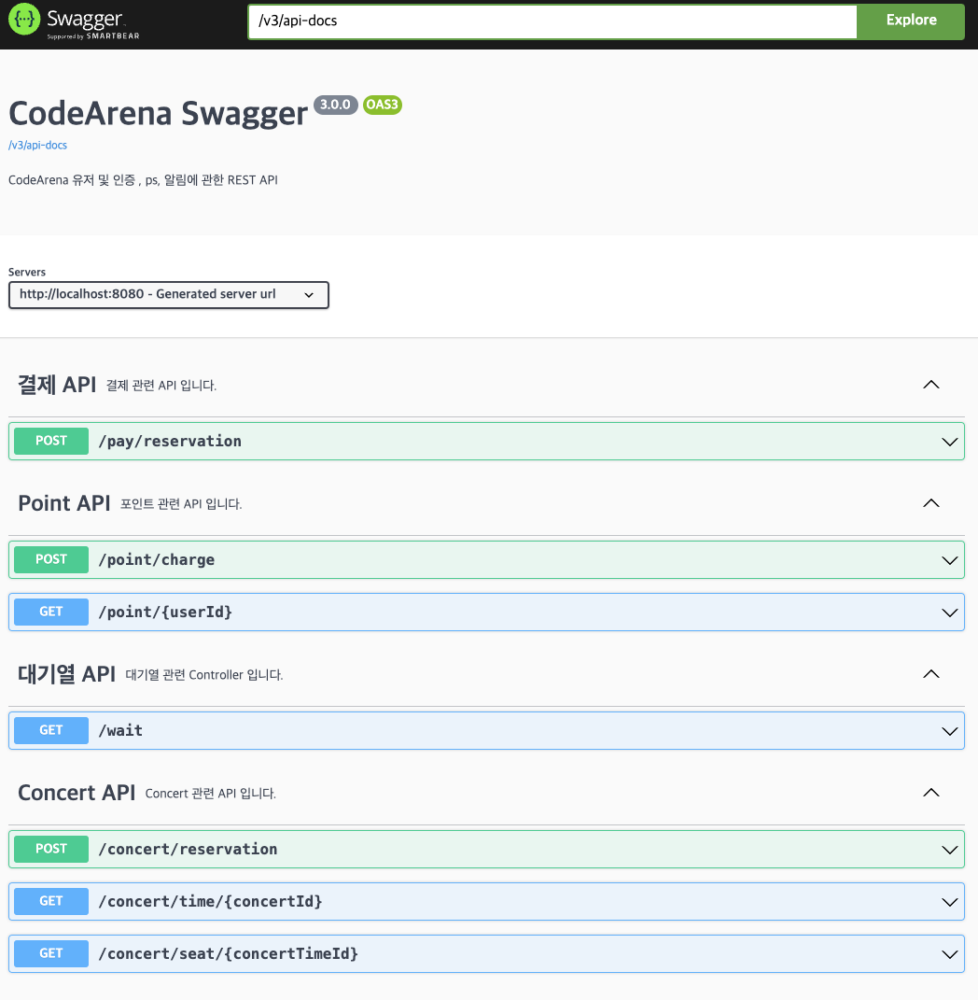

## 시나리오 선정
### Concert Scenario
* 대기열 구현이 매력적이라 선택했습니다.

## configuration

* JAVA 17
* JPA
* MYSQL

## Documents

* ### [PROJECT MILESTONE](https://github.com/users/CureLatte/projects/4/views/1?sortedBy%5Bdirection%5D=asc&sortedBy%5BcolumnId%5D=Milestone)
* ### [SEQUENCE Diagram](docs/sequence.md)
* ### [ERD Diagram](docs/ERD.md)
* ### [API DOCS](docs/API.md)
* 

## 보고서
* ### [동시성 문제 보고서](docs/concurrencyReport.md)
* ### [대기열 Redis 전환 보고서](docs/convertRedisReport)
* ### [Index 를 활용한 Query 최적화](docs/DBIndex.md)