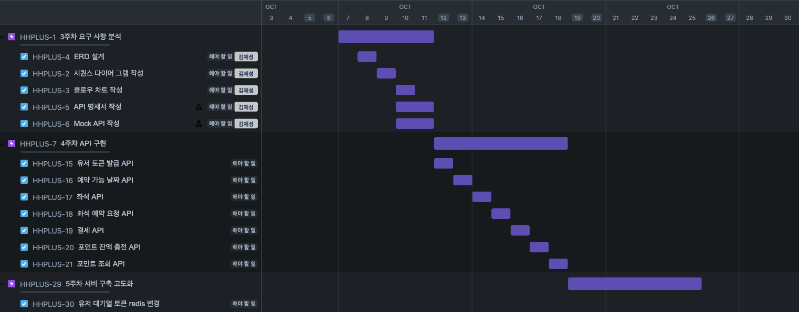

## 시나리오 선정
### Concert Scenario
* 대기열 구현이 매력적이라 선택했습니다.

## configuration

* JAVA 17
* JPA
* MYSQL

## Milestone 

### JIRA - [Jira 홈페이지 이동](https://zhqmfkv.atlassian.net/jira/software/projects/HHPLUS/boards/2/timeline?shared=&atlOrigin=eyJpIjoiZGIwZmEyM2RjZGI0NDYxNGJiZDg3YmUxYTk3Mjk4OTUiLCJwIjoiaiJ9)

## Documents
* ### [시퀀스 다이어 그램](docs/sequence.md)
* ### [ERD 다이어 그램](docs/image)

# Sequence Diagram
* User
  * 대기열 Token 생성  
    
  * 

## API 명세서 

* User
  * [POST] 유저 token 생성 
    * [flowChart](https://sequencediagram.org/index.html#initialData=C4S2BsFMAJAJxwACeoAsXAOC9AggBQJIChcCqAzpAE4C0AfAMpkBuZAXFttICljgtTMAUAriadgAmASnwBDAMag6Y4DFqkGpXAqXkqAdTFgAij0j6AKmIBGURnESpogBwnAMWvsOuSdNkwtu-UdNR8H4HoGkMZmMFTQqkyWyGic0LiCkC4gMnLQ-oHeoSr0ZNDhkaQW1oCqa4Ae4-jO4MAxgC7j0IAR44Ai49CAvTWADWO40BG5pPmUPYpRgADNgAx10IA7Q4AgNQA00GPQZYALY9CAGEPQgCM1gA0DXfHduJDgJDG2DoAnQ4AUy4AGq22d3YX96doBXsE+kBbAAPYA1pAAdtBALsDgEZBxx7aDJVLuZ6ZN7ZboZV4hKCPQoWf6QADu0EMvwB0AASpBgDxSP9dokoW4np4gijIPgAYJ4rsHuFiFE8X9AaQSWSKVSpCkaYVKkA)
* Concert

## ERD Diagram 

