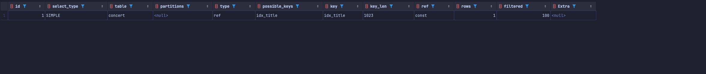

# DB INDEX 를 이용한 작업 계획서
*** 

데이터 베이스의 데이터가 많아질 경우 

조회의 속도가 굉장히 느려질 수 있다. 

느려지는 이유는 트랜잭션 `Lock`, 검색 범위가 넓은 경우, 불필요한 `Join` 등등 

단순히 데이터가 많아진 경우라면 `Index` 를 이용하면 훨씬 빠르게 데이터 조회가 가능하다.

<br>


## INDEX 란?

이름에서 알수 있듯이 색인 목록 즉 정보를 찾기위한 지름길의 역할을 한다.

기본적으로 `DataBase` 에서는 기본키인 `Primary key` 를 기반으로 인덱스가 정해져있다.

이러한 `PrimaryKey` 는 `AutoGenerate` 형식으로 `ID` 가 새로 증가할 수밖에 없으므로 

순서정렬이 되어있는 상태이기 때문에 

특정 `ID` 를 검색을하면 데이터가 얼마나 많이 존재하던 빠르게 조회가 가능하다.


이것이 가능한 이유는 `B-Tree` 구조로 순서정렬이 되어있기 때문에

`절반 조회` -> `절반 조회` -> ... 방식을 거쳐 몇번의 방법만에 조회가 가능하다. 


이걸 기본 `KEY` 말고 다른 `Column` 에게도 적용하는 것이 인덱스를 생성/적용한다고 한다.


### 하나만 가능할까?

인덱스는 하나의 `Column` 만 가능한 것이 아닌 여러가지 `Column` 을 적용할 수 있고 이를 복합 인덱스 라고 한다.

이때 선언 순서에 따라 순서정렬을 진행하므로 순서에 유의하면서 적용해야한다. 

### 단점
해당 방식은 순서정렬을 위해 보인는 거와 다르게 Database 가 숨겨진 정렬 데이터를 갖고 있는데 
이는 조회할 때는 문제가 되질 않지만 
해당 `Table` 에서 `Create`, `Update`, `Delete` 가 실행이 될 때마다 
숨겨진 정렬조건을 다시 재 정렬해야하는 문제가 발생한다.

즉 테이블의 변화가 가장 많이 일어나는 곳에서는 사용할수록 성능이 오히려 나빠지는 단점이 존재한다.


<br>

## 동작 방식
`Query` 를 작성하고 실제 명령어를 실행할 때 `DataBase` 에서는 

해당 쿼리를 빠르게 찾을 만한 방법을 찾게 되는데 이때 찾아야하는 조건 중 
해당 `Column` 이 `Index` 가 걸려있다면 해당 `Index` 를 이용하여 더 빠르게 찾게 된다.

만약 `Index` 가 걸려있지 않다면 당연히 전체 `Table` 을 하나씩 확인하는 `Full Scan` 을 하게 된다.

이떄 실행계획을 미리 확인해 볼 수 있는데 

방법은 `Query` 앞에 `explain` 이라는 명령어를 넣게 된다면 
어떤 식으로 데이터를 찾을지 `Table` 형식으로 알려준다.

<table>
<thead>
    <tr>
        <td>id</td>
        <td>select_type</td>
        <td>table</td>
        <td>partitions</td>
        <td>type</td>
        <td>possible_keys</td>
        <td>key</td>
        <td>key_len</td>
        <td>ref</td>
        <td>rows</td>
        <td>filtered</td>
        <td>Extra</td>
    </tr>
</thead>
<tbody>
    <tr>
        <td>-</td>
        <td>조회 방식</td>
        <td>조회 테이블</td>
        <td>-</td>
        <td>조회 방식</td>
        <td>사용 가능 한 INDEX</td>
        <td>사용 INDEX</td>
        <td>index Key 길이</td>
        <td>-</td>
        <td>-</td>
        <td>-</td>
        <td>-</td>
    </tr>
</tbody>
</table>


이중 `PossibleKey` 와 `type`, `key` 를 확인해보면 `Index` 를 이용한지 확인할 수 있다.

특히
`type` 에서 `ALL` 이라고 조회된다면 `Full SCAN` 을 한 것이다. 

<br>


## 적합한 `INDEX` 사용 방법 

적합한 `Index` 를 사용하기 위해선 어떻게 해야 순서정렬에 용인한가? 를 기준으로 봐도 좋을 것같다. 

### 1. 데이터 중복이 적은 `Column` 일 수록 좋다. 

즉 하나의 `100 만건`에 대한 `Data` 중에 단순히 `4가지`의 값만 존재 하는 데이터와
`100만 건` 중  `80만건`이 서로 다른 값인 데이터 중 순서정렬을 할때 더 명확해 지는 데이터는
당연히 후자이자

이러한 부분이 데이터 중복이 적을 수록 `Index` 를 이용하기 정합하다 라고 할 수있다.

이걸 용어로는 `Cardinality(중복도)` 가 높다 라고 표현한다. 


### 2. 인덱스로 설정된 `Column` 그대로 사용해야한다.

`Index` 로 `testColumn` 을 지정한다면 

`Index` 를 이용하기 위해선 `where` 절에서 `testColumn` 자체로 정렬을 해야만한다.


그렇지 않고 `testColumn + 3` 이라는 조건이 들어간다면 전체 데이터에 `3`을 더해야 하기 때문에 

`DataBase` 는 순서를 다시 정렬해야만 한다. 

따라서 전체 `Table` 을 확인해봐야하기 때문에 무의미하게 된다.

<br>

## 해당 서버에서 적용 가능한 부분
기본적으로 조회가 가장 많이 얼어나는 부분은 

* `콘서트 조회`
* `콘서트 날짜 조회`
* `콘서트 좌석 조회`
* `포인트 조회 `

정도가 있다. 

이 중에서 `Index` 의 단점을 부각시킬 수 있는 변화가 많이 발생하는 부분은   
콘서트 좌석 `Table` 이므로 좌석 조회는 제외하고   
포인트 또한 유저의 충전이 좌석 만큼이나 많이 이루어지므로 제외한다.  

따라서 콘서트와 콘서트 날짜는 한번 정해지면 변화가 크게 없기도 하고   
인기가 많을 수록 조회하는 `API` 가 크게 향상될 여지가 많기 때문에   

* `콘서트 조회 API`
* `날짜 조회 API`

에서 `Index` 를 이용하는 것이 적당하다.

<br> 

## 수정 사항

인덱스를 생성하기 위한 적절한 `API` 는 검색 `API` 가 
적절할 것으로 보인다.

검색 조건에서 주로 사용하는 조건은 아래로 정리가 될 수 있다.

* 제목
* 날짜 
* 관람 등급
* 장소

이 중 가장 중복도가 높은 `Column` 제목일 수 밖에 없다.
제목은 콘서트마다 다양하게 들어가고 
주기적으로 하는 콘서트도 회차로도 분류가 가능하니까 말이다.

그래서 첫번째로 꼭 제목을 먼저 `Index` 를 생성해야한다.


두번째로 중복도가 높은 `Column` 은 날짜라고 생각된다.

다른 2개의 컬럼의 경우 갯수가 어느 정도 정해져 있기 때문에 

콘서트의 개수가 늘어나더라도 영향이 크게 없을 거라 생각된다.

그리고 콘서트를 같은 날, 같은 시간에 진행하는 곳도 있겠지만 

매우 많을 것으로는 생각이 되질 않으므로 

해당 일시에 도 `Index Column` 을 추가하는 것이 적당하다.


<br>

## 코드 구현

`JPA` 를 이용하기 때문에 

`JPA Entity` 에서 `Index` 설정을 해주면 된다.

### CONCERT ENTITY

``` java
@Entity
@table(name="concert", indexes = @Index(name="idx_title", columnList = "title"))
@EntityListeners(AuditingEntityListener.class)
public class ConcertEntity {
    @Id @GeneratedValue(strategy = GenerationType.IDENTITY)
    private Long id;
    
    ...    
}

```

### CONCERT TIME ENTITY

```java
@Entity
@talbe(name="concert_time", indexs={@Index(name="idx_start_time", columnList="start_time")})
public class ConcertTimeEntity {
    @Id @GeneratedValue(strategy = GenerationType.IDENTITY)
    private Long id;
    
}

```


### MYSQL 설정
테스트를 진행하려면
`Query` 를 이용하여 직접 인덱스를 맺어서 테스트를 할수도 있다.


#### 인덱스 조회
```mysql
show index from [테이블명];

# 예시)
show index from concert;

```
#### 인덱스 생성
```mysql
create index [인덱스 이름] on [테이블 명]([컬럼 명] [ASC / DESC])

# 예시)
create index idx_title on concert(title asc)
create index idx_id_title on concert(id, title asc)
```

#### 인덱스 삭제 
``` mysql
drop index [인덱스 이름] from [테이블 명];

# 예시
drop index idx_title from concert;
```

<br>


## 테스트
해당 인덱스의 성능을 확인하기 위해 대용량 `Data` 를 넣고 테스트를 진행해 보았습니다.  
[Insert Data 스크립트 참조](../src/test/groovy/io/hhplus/tdd/hhplusconcertjava/integration/BigDataInsert.java)  


* 콘서트 데이터 (table: `Concert`)
  * 제목으로 검색할 가능성이 많으므로 제목이 다른 약 `1,700,000` 만건에 대해 진행
  * concert_번호 형식 (`concert_1`, `concert_2`, ...) + concertTheme 형식 ( `제 2 회 아이유 콘서트`)   
    


### 인덱스 사용 전
* `Table Index` 리스트 


* Query 
```mysql 
select *
from concert
where title = "제 7804 회아이유 콘서트";
```

* 실행 계획  - 인덱스 사용 X 확인


* 진행 시간  

    

### 약 `1초 550 ms` 소요 

<br>


### 인덱스 사용 후
***

* `Table Index` 리스트
  

* Query
```mysql 
select *
from concert
where title = "제 7804 회아이유 콘서트";
```

* 실행 계획 - 인덱스 사용 확인
  

* 진행 시간  
  

### 약 `292 ms` 소요


인덱스 사용전 보다 `1초 258ms` 만큼 빨리 결과가 나왔다.

`430%` 정도 성능이 향상됨

물론 제한 적인 상황이기도 하고 비교한 데이터가 매우 많아서 
이례적인 수치지만 `INDEX` 를 사용하면 이전보다 성능 향상이 더 된다는 것은
확연히 차이를 보여준것 같다.


<br>


## 마무리

이처럼 2개의 `Table` 에 `Index` 를 적용한다면
조회시 더 나은 선능 향상을 기대해 볼 수 있을 거라 예상된다.


