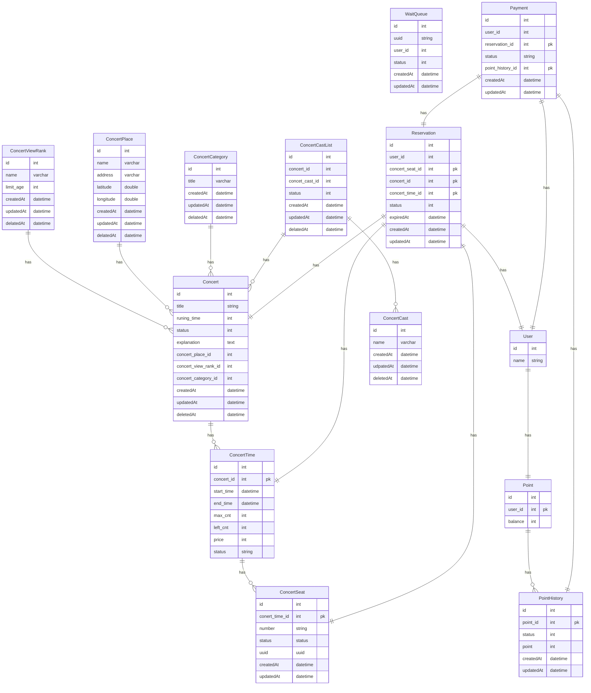

# ERD Diagram 

```mermaid
erDiagram
    WaitQueue{
        id int
        uuid string  
        user_id int
        status int
        createdAt datetime 
        updatedAt datetime 
    }
    
    
    User {
        id int
        name string
    }

    User ||--|| Point: has
    
    Point {
        id int
        user_id int pk
        balance int
    }
    Point ||--o{ PointHistory: has
    
    
    PointHistory {
        id int 
        point_id int pk
        status int 
        point int
        createdAt datetime 
        updatedAt datetime
    }
    
    Concert{
        id int 
        title string 
        runing_time int
        status int
        explanation text
        
        concert_place_id int
        concert_view_rank_id int
        concert_category_id int
        
        
        createdAt datetime
        updatedAt datetime 
        deletedAt datetime
    }


    Concert ||--o{ ConcertTime: has
    
    ConcertViewRank{
        id int    
        name varchar
        limit_age int
        
        createdAt datetime
        updatedAt datetime
        delatedAt datetime
    }

ConcertViewRank ||--o{ Concert: has
    
   
    

    ConcertPlace {
        id int
        name varchar
        address varchar 
        latitude double
        longitude double
        
        
        createdAt datetime
        updatedAt datetime 
        delatedAt datetime
            
    }

ConcertPlace ||--o{ Concert : has
    
     
    ConcertCategory{
        id int
        title varchar
        
        

        createdAt datetime
        updatedAt datetime
        delatedAt datetime
    }
    
    ConcertCategory ||--o{ Concert: has
     
    ConcertCastList{
        id int
        concert_id int 
        concet_cast_id int
        status int
        
        createdAt datetime
        updatedAt datetime
        delatedAt datetime
        
    }

    ConcertCastList ||--o{ ConcertCast: has
    ConcertCastList ||--o{ Concert : has


    ConcertCast{
        id int
        name varchar
        
        
        createdAt datetime
        udpatedAt datetime 
        deletedAt datetime
        
    }  
    


    ConcertTime {
        id int
        concert_id int pk
        start_time datetime 
        end_time datetime
        max_cnt int
        left_cnt int 
        price int 
        status string
        
    }
    ConcertTime ||--o{ ConcertSeat: has
    
    ConcertSeat {
        id int
        conert_time_id int pk
        number string
        status status
        uuid uuid 
        createdAt datetime 
        updatedAt datetime 
    }
    
    Reservation {
        id int 
        user_id int
        concert_seat_id int pk
        concert_id int pk
        concert_time_id int pk
        status int
        expiredAt datetime
        createdAt datetime 
        updatedAt datetime 
        
    }
    
    Reservation || -- || Concert: has
    Reservation ||--|| ConcertTime: has
    Reservation ||--|| User: has    
    Reservation ||--|| ConcertSeat: has
    
    
    Payment {
        id int
        user_id int
        reservation_id int pk
        status string
        point_history_id int pk
        createdAt datetime
        updatedAt datetime
        
    }
    
    Payment ||--|| Reservation: has
    Payment ||--|| PointHistory: has
    Payment ||--|| User: has
    
    
    
    
    
    
    
    
    
    
    
    
    
```