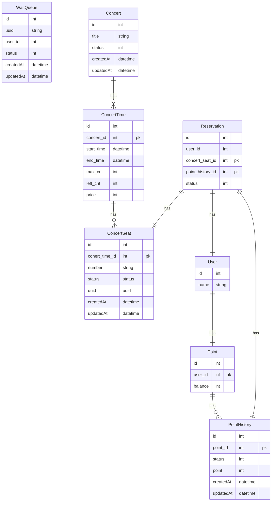

# ERD Diagram 

```mermaid
erDiagram
    WaitQueue{
        id int
        uuid string  
        user_id int
        status int
        createdAt datetime 
        updatedAt datetime 
    }
    
    
    User {
        id int
        name string
    }

    User ||--|| Point: has
    
    Point {
        id int
        user_id int pk
        balance int
    }
    Point ||--o{ PointHistory: has
    
    
    PointHistory {
        id int 
        point_id int pk
        status int 
        point int
        createdAt datetime 
        updatedAt datetime
    }
    
    Concert{
        id int 
        title string 
        status int 
        createdAt datetime
        updatedAt datetime 
    }
    Concert ||--o{ ConcertTime: has

    ConcertTime {
        id int
        concert_id int pk
        start_time datetime 
        end_time datetime
        max_cnt int
        left_cnt int 
        price int 
        
    }
    ConcertTime ||--o{ ConcertSeat: has
    
    ConcertSeat {
        id int
        conert_time_id int pk
        number string
        status status
        uuid uuid 
        createdAt datetime 
        updatedAt datetime 
    }
    
    Reservation {
        id int 
        user_id int
        concert_seat_id int pk
        point_history_id int pk
        status int 
    }
    Reservation ||--|| PointHistory: has
    Reservation ||--|| User: has
    Reservation ||--|| ConcertSeat: has
    
    
    
    
    
    
    
    
    
    
```