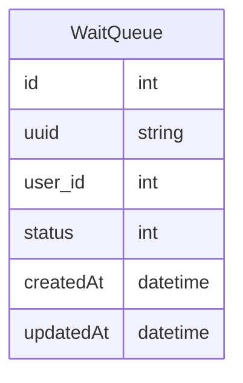

# 성능 향상을 위한 대기열 전환
*** 

## 개요 
해당 보고서는 실제 벌어진 상황은 아니지만
성능 향상을 위해  

가장 고전적으로 구현된 대기열 서비스를 
개선하고자 작성했습니다.


<br>

## 기존 구현 방식 

DataBase 를 이용하여 구현하였으며   
User 의 상태와 생성시간, 수정 시간을  저장합니다.

### WaitQueue Table


이후 
Node-scheduler 를 이용하여   
약 5초 마다 대기열 관리 로직이 진행이 됩니다.

대기열 관리 로직은   
최대 이용 시간을 지난 유저 삭제,  
삭제된 유저만큼 대기하고 있던 가장 최신 순서로 대기열의 상태를 Update 시키는 로직입니다.


``` java
// WaitScheduler 
@Component
@AllArgsConstructor
public class WaitScheduler {

    private IWaitService waitService;


    @Scheduled(cron="*/5 * * * * *")
    public void updateProcessCnt(){
        this.waitService.updateProcessWaitQueue();
    }

}

public WaitService {
    // DI...
    
    
   @Override
   @Transactional
   public void updateProcessWaitQueue() {
   
   
   // finish 인 경우 -> delete
   this.waitQueueRepository.deleteFinish();
   
   
   // 작업 시간 생성 후 30분 이상 차이 -> delete
   this.waitQueueRepository.deleteTimeout(); 
   
   
   // 남은 작업 인원 확인
   Integer leftCnt = this.waitQueueRepository.countProcess();
   WaitQueue waitQueue = WaitQueue.builder().build();
   
   // 30명 이상인경우 return
   if(leftCnt >= waitQueue.MaxCnt){
      return;
   }
   
   // wait 변경 인원수 파악
   Integer addCnt = waitQueue.getMaxCnt() - leftCnt;
   
   // update
   this.waitQueueRepository.updateStatusOrderByCreatedAt(addCnt);
   
   
   }

}

```

### 장점: 
* 구현이 쉽다.

### 단점: 
* 대기열이 많아지게 되면 조회 로직이 오래걸림
* DB 에 부하가 많아질 수 있다. ( 인원이 많이 몰릴 경우 )


## 그렇다면 왜 Redis 를 이용해야하는가?
* `InMemory` 와 자료구조를 이용한 조회 속도 향상
* TTL 을 이용한 만료기간 자동 설정 기능 -> 로직 최소화
* DataBase 용량 확보 
* 데기열 정보는 데이터 저장까지는 굳이 필요 없는 정보


## Redis 를 이용한 대기열 구현 방식 

기존의 `DataBase` 에서는 대기열의 상태라는 값이 있었기 때문에 

하나의 `Table` 로 진행을 했지만 `Redis` 의 경우에는 상태라는 값을 중복으로 둘 수 없기 때문에 

`Redis` 의 자료구조인` Sorted Set` 을 이용하여 `WaitQueue` 를 구현하고

현재 작업을 가능할 수 있도록 활성상태를 `ActiveQueue` 를 구현하여 

지정된 조건마다 시간 순서로 정렬된 `WaitQueue` 중 가장 최신의 일정 유저만 `ActivateQueue` 로 옮기는 방식이다.


1. `WaitQueue` 에 대기열을 생성
2. 지정된 스케줄러 마다   
   1. 상위 `WaitQueue` 조회   
   2. `ActivateQueue` 생성    
   3. `WaitQueue` 상위 삭제


이때 `ActivateQueue` 의 삭제는 스케쥴러의 로직이 아닌 `Redis` `의` TTL 기능을 이용하면 로직에서도 제외할 수 있다.


```java

   public class WaitService implements IWaitService {
    
        public void redisInsertWaitQueue(){
            
            // WaitQueue Insert
            
            return null;
        }
        
        public void redisUpdateWaitQueue(){
            
            //  get Redis SortedSet Range -1, -30
            
           // insert ActivateQueue 
           
           // Setting TTL 
           
           // Delete WaitQueue
           
        }
    
   }

```


### 상태 업데이트 방식 변경
기존의 대기열의 로직에서 상태를 변경하는 로직 또한 변경을 노려볼 수 있다.  

대기 -> 활성으로 넘기는 업데이트 기준은 크게 2가지로 나뉘는데 
예를 들어 최대 30명 이라고 한다면

1. 활성유저가 제한인원인 30명을 유지할 수 있도록 작업을 마무리한 인원 만큼 대기열을 들여보내준다.
2. 일정한 시간마당 일정 량의 유저를 들여보내 준다.

### 1번 케이스 
#### 장점
* 서버 부하를 일정하게 가져감으로 부하를 줄일 수 있다.
#### 단점
* 활성화된 유저가 언제 나갈지 알 수 없으므로 무한 대기가 발생할 수 있다.
* 요청이 많아질 경우 Table 데이터가 많아져 관리가 어렵다. 
* 대기 시간을 예측하기 힘들다
* 먼저온 유저의 대기 시간에 따라 뒤에 있는 유저에게 영향이 간다.


### 2번 케이스
#### 장점
* 대기 시간을 예측하기 쉽다
* 앞사람의 영향이 크게 작용하진 않는다.
* 기다리는 유저의 성능이 올라간다.

#### 단점
* 들여보내는 유저수를 적절하게 선정하지 않을 경우 부가적인 문제가 생긴다.
* TPS, 유저수, 등등 게산이 필요하다


### 이번 로직 개선에 상태 업데이트도 변경할 예정이므로 2번을 채택하여 진행한다.

  