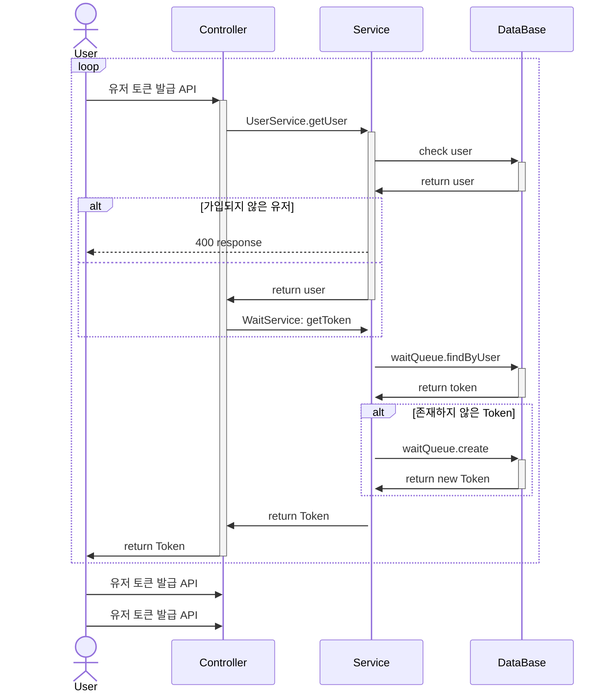
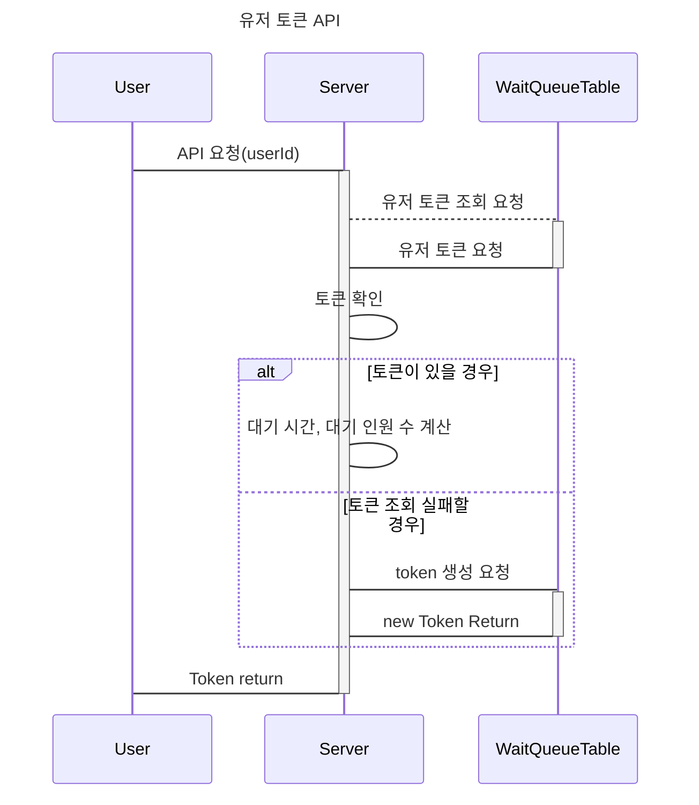
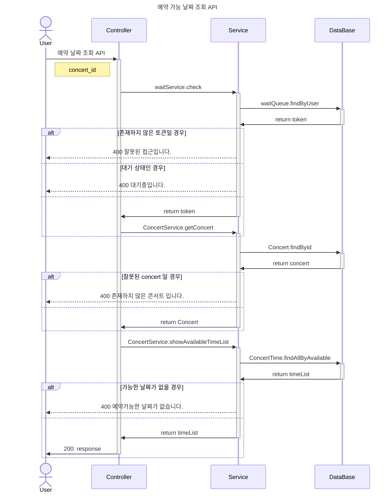

# 목차 
* ### [유저 토큰 발급 API ](#유저-토큰-발급-api-)
* ### [예약 가능 날짜 조회 API](#예약-가능-날짜-조회-api)
* ### [좌석 조회 API](#좌석-조회-api)
* ### [좌석 예약 API](#좌석-예약-api-)
* ### [포인트 조회 API](#포인트-조회-api)
* ### [포인트 충전 API](#포인트-충전-api)
* ### [결제 API](#결제-api-)


## 좌석 예약 시스템 


## 유저 토큰 발급 API 



<br>
<br>
<br>

## 예약 가능 날짜 조회 API




<br>
<br>
<br>


## 좌석 조회 API


```mermaid 
sequenceDiagram
    title 좌석 조회 API 
    
    
    User -> Server: request: user_id, consert_time_id
    activate Server #98ff8c
    
    
    Server -> WaitQueueTable: Token 조회 요청
    activate WaitQueueTable
    
    WaitQueueTable -> Server: return Token
    deactivate WaitQueueTable
    
    Server -> Server: token 확인
    
    
    activate Server #fad0ca
    activate Server #fad0ca
    alt token 없을 경우 
     
      Server -> User: 400 Response: 잘못된 요청입니다.
      deactivate Server #fad0ca
    else wait 일경우 
      Server -> User: 400 Response: 접근권한이 없습니다.
      deactivate Server #fad0ca
    end
    
    
    
    Server -> ConcertTimeTable: concert_time_id 조회 요청
    activate ConcertTimeTable
    ConcertTimeTable -> Server: return Concert_time_id 
    deactivate ConcertTimeTable
    
    
    Server -> Server: concert_time 확인
    
    activate Server #fad0ca
    
    alt 없을 경우 
      Server -> User: 400 response: 예약 가능한 날짜가 아닙니다.
      deactivate Server #fad0ca
    end
    
    
    Server -> SeatTable: 예약 가능한 좌석 요청 
    activate SeatTable
    SeatTable -> Server: return 좌석 리스트
    deactivate SeatTable
    
    
    
    Server -> User: 200 response
    deactivate Server


```


<br>
<br>
<br>

## 좌석 예약 API 

```mermaid
sequenceDiagram

    title 좌석 예약 요청 API


    User -> Server: request: user_id, concert_seat_id

    activate Server #98ff8c


    Server -> WaitQueueTable: token 확인 요청
    activate WaitQueueTable

    WaitQueueTable -> Server: return token
    deactivate WaitQueueTable


    Server -> Server: token 확인

    activate Server #fad0ca
    activate Server #fad0ca
    alt token 없을 경우

        Server -> User: 400 Response: 잘못된 요청입니다.
        deactivate Server #fad0ca
    else wait 일경우
        Server -> User: 400 Response: 접근권한이 없습니다.
        deactivate Server #fad0ca
    end


    Server -> SeatTable: 좌석 조회 요청

    activate SeatTable

    SeatTable -> Server: return 좌석

    deactivate SeatTable


    Server -> Server: 좌석 확인

    activate Server #fad0ca

    alt 이미 선택된 좌석일 경우

        Server -> User: 400 response: 이미 선택된 좌석입니다.
        deactivate Server #fad0ca
    end


    Server -> SeatTable: 좌석 생성 요청
    activate SeatTable

    SeatTable -> Server: return 좌석

    deactivate SeatTable

    Server -> SeatTable: 남은 좌석 조회: concert_time_id
    activate SeatTable

    SeatTable -> Server: return 남은 좌석
    deactivate SeatTable

    Server -> ConcertTimeTable: 남은 좌석 업데이트 요청
    activate ConcertTimeTable

    ConcertTimeTable -> Server: success
    deactivate ConcertTimeTable


    Server -> User: 200 response
    deactivate Server #98ff8c


```

<br>
<br>
<br>


## 포인트 조회 API

```mermaid
sequenceDiagram

    title 포인트 조회 API


    User -> Server: request: user_id

    activate Server #98ff8c


    Server -> UserTable: user_id 조회요청
    activate UserTable

    UserTable -> Server: return User
    deactivate UserTable

    activate Server #fad0ca

    alt 존재하지 않은 유저

        Server -> User: 400 Response: 존재하지 않은 유저 입니다.

        deactivate Server

    end


    Server -> PointTable: 포인트 조회 요청
    activate PointTable

    PointTable -> Server: return point
    deactivate PointTable

    Server -> Server: point 확인

    alt 포인트가 존재 하지 않음 (첫 조회)
        Server -> PointTable: 포인트 생성 요청
        activate PointTable
        PointTable -> Server: return Point
    end


    Server -> User: 200 response

    deactivate Server #98ff8c


```

<br>
<br>
<br>


## 포인트 충전 API

```mermaid
sequenceDiagram

    title 포인트 충전 API

    User -> Server: request: user_id, point
    activate Server #98ff8c

    Server -> UserTable: user 조회 요청
    activate UserTable

    UserTable -> Server: return user

    deactivate UserTable


    Server -> PointTable: 포인트 조회 요청
    activate PointTable


    PointTable -> Server: return 포인트 (잔액)

    deactivate PointTable


    Server -> Server: 포인트 확인

    alt 포인트 없을 경우
        Server -> PointTable: 포인트 생성 요청
        activate PointTable

        PointTable -> Server: return 포인트

        deactivate PointTable

    end


    Server -> PointTable: 포인트 증가 요청
    activate PointTable

    PointTable -> Server: 요청 결과

    deactivate PointTable


    Server -> PointHistoryTable: 포인트 기록 생성 요청
    activate PointHistoryTable

    PointHistoryTable -> Server: return 포인트 기록

    deactivate PointHistoryTable


    Server -> User: 200 response

    deactivate Server

```

<br>
<br>
<br>

## 결제 API 


```mermaid
sequenceDiagram
    title 결제 API

    User -> Server: request: user_id, reservation_id

    activate Server #98ff8c

    Server -> WaitQueueTable: token 조회 요청
    activate WaitQueueTable


    WaitQueueTable -> Server:  return token

    deactivate WaitQueueTable


    Server -> Server: token 확인
    activate Server #fad0ca
    activate Server #fad0ca


    alt token 없을 경우

        Server -> User: 400 Response: 잘못된 요청입니다.
        deactivate Server #fad0ca
    else wait 일경우
        Server -> User: 400 Response: 접근권한이 없습니다.
        deactivate Server #fad0ca
    end


    Server -> ReservationTable: 예약 조회 요청
    activate ReservationTable
    ReservationTable -> Server: return 예약

    deactivate ReservationTable

    Server -> Server: 예약 확인

    activate Server #fad0ca
    activate Server #fad0ca


    alt 없는 예약 일 경우
        Server ->  User: 존재하지 않은 예약입니다.

        deactivate Server

    else 이미 결제 완료가 된 경우
        Server -> User: 결제 완료된 예약입니다.
        deactivate Server
    end


    Server -> PointTable: user_id 포인트 조회 요청
    activate PointTable

    PointTable -> Server: return point
    deactivate PointTable

    activate Server #fad0ca

    alt 포인트가 없을 경우
        Server -> User: 400 response: 남은 포인트가 존재하지 않습니다.
        deactivate Server
    end


    Server -> SeatTable: 좌석 조회 요청
    activate SeatTable

    SeatTable -> Server: return 좌석
    deactivate SeatTable


    Server -> User: 200 response
    deactivate Server


```
