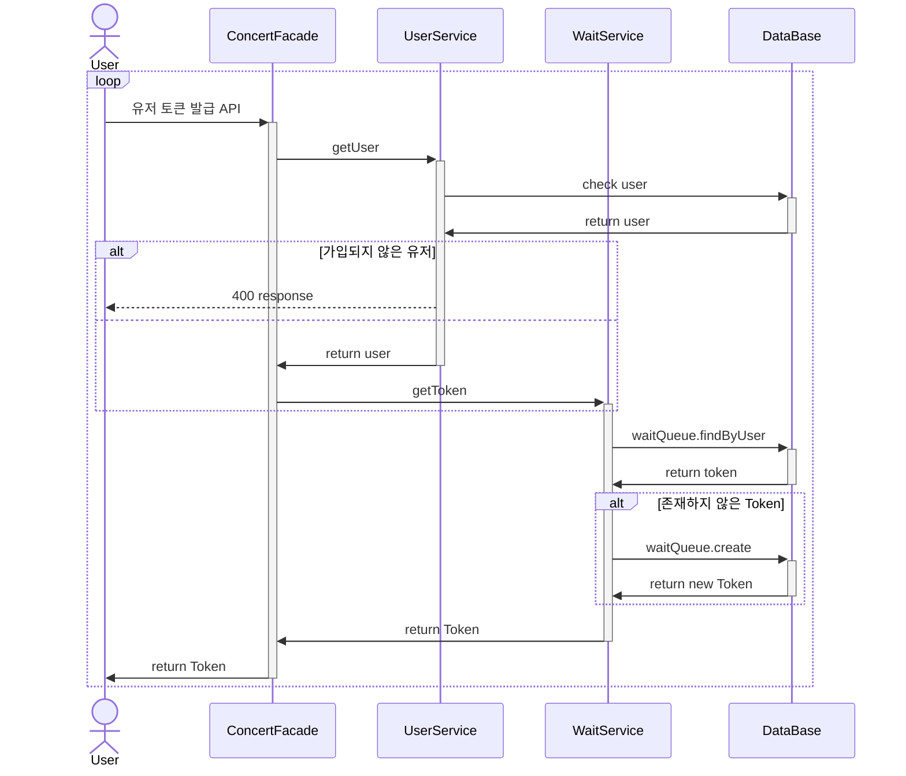
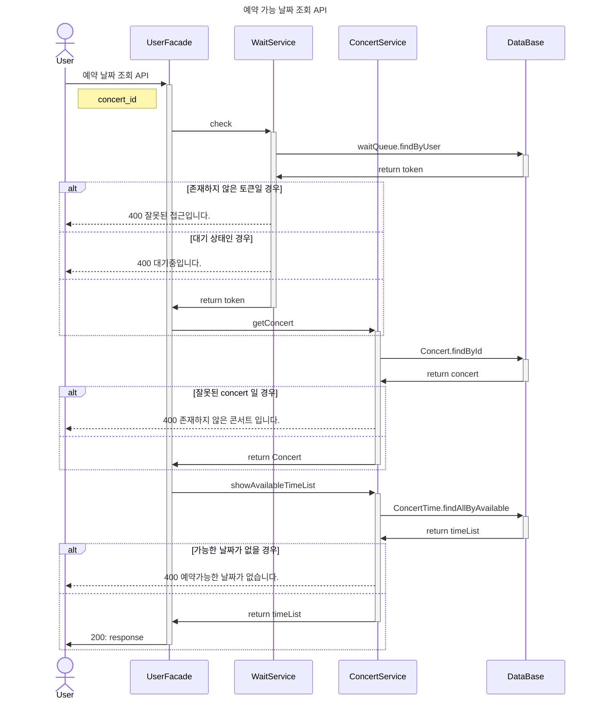

# 목차 
* ### [유저 토큰 발급 API ](#유저-토큰-발급-api-)
* ### [예약 가능 날짜 조회 API](#예약-가능-날짜-조회-api)
* ### [좌석 조회 API](#좌석-조회-api)
* ### [좌석 예약 API](#좌석-예약-api-)
* ### [포인트 조회 API](#포인트-조회-api)
* ### [포인트 충전 API](#포인트-충전-api)
* ### [결제 API](#결제-api-)


## 유저 토큰 발급 API



<br>
<br>
<br>

## 예약 가능 날짜 조회 API




<br>
<br>
<br>


## 좌석 조회 API


```mermaid 
sequenceDiagram
    title 좌석 조회 API
    
    Actor User as Client 
    participant ConcertFacade as ConcertFacade
    
    participant WaitService 
    participant ConcertService
    participant DataBase
    
    User ->> ConcertFacade: request: user_id, concert_time_id
    activate ConcertFacade #98ff8c
    
    activate WaitService
    ConcertFacade ->> WaitService: getToken
    activate WaitService
    WaitService ->> DataBase: findByUser
    activate DataBase 
    DataBase ->> WaitService: return Token
    deactivate DataBase
    WaitService ->> ConcertFacade: return Token
    deactivate WaitService
    
    ConcertFacade ->> ConcertFacade: token 확인
    
    alt token 없을 경우

        ConcertFacade -->> User: 400 Response: 잘못된 요청입니다.
      
    else wait 일경우
        ConcertFacade -->> User: 400 Response: 접근권한이 없습니다.
    else 
        ConcertFacade ->> ConcertService: getConcertTime
       
    end


    activate ConcertService
    
    ConcertService ->> DataBase: findById
    activate DataBase 
    
    DataBase ->> ConcertService: return ConcertTime
    deactivate DataBase 
    
    alt 존재하지 않은 경우 
        ConcertService -->> User: 400 response: 예약 가능한 날짜가 아닙니다.
    else
        ConcertService ->> ConcertFacade: return ConcertTime
    end
    
    deactivate ConcertService

    ConcertFacade ->> ConcertService: getSeatList
    activate ConcertService

    ConcertService ->> DataBase: 예약 가능한 좌석 요청 
    activate DataBase
    DataBase ->> ConcertService: return 좌석 리스트
    deactivate DataBase

    alt 남은 좌석이 없을 경우 
        ConcertService -->> User: 400 Response: 남은 좌석이 존재하지 않습니다.
    else
    ConcertService ->> ConcertFacade: return SeatList
    end
    deactivate ConcertService
   

ConcertFacade -> User: 200 response
    deactivate ConcertFacade


```


<br>
<br>
<br>

## 좌석 예약 API 

```mermaid
sequenceDiagram

    title 좌석 예약 요청 API
    
    actor User 
    participant ConcertFacade
    participant WaitService 
    participant ConcertService 
    participant DataBase
    

    User ->> ConcertFacade: request: user_id, concert_seat_id
    activate ConcertFacade #98ff8c
    
    ConcertFacade->> WaitService: getUser
    activate WaitService

    WaitService ->> DataBase: findById 
    activate DataBase 
    DataBase ->> WaitService: return user 
    deactivate DataBase 
    
    alt 토큰이 없는 경우 
        WaitService -->> User: 400: 잘못된 요청 입니다.
    else 대기 상태인 경우 
         WaitService -->> User: 400: 접근 권한이 없습니다.
    else 
        WaitService ->> ConcertFacade: return User
    end
    
    deactivate WaitService

    ConcertFacade ->> ConcertService: getSeat
    activate ConcertService


    ConcertService ->> DataBase: 좌석 조회 요청

    activate DataBase

    DataBase ->> ConcertService: return 좌석

    deactivate DataBase


    alt 이미 선택된 좌석일 경우

        ConcertService -->> User: 400 response: 이미 선택된 좌석입니다.
    else 
        ConcertService ->> ConcertFacade: return Seat 
    end
    

    ConcertFacade ->> ConcertService: createSeat
    activate ConcertService
    
    ConcertService ->> DataBase: updateById
    
    activate DataBase

    DataBase ->> ConcertService: return seat

    deactivate DataBase
    
    
        
    ConcertService ->> DataBase: create reservation 
    
    activate DataBase
    DataBase ->> ConcertService: return  new
    deactivate DataBase

    ConcertService ->> ConcertFacade: return seat
    
    deactivate ConcertService
    
    ConcertFacade ->> User: 200 response
    deactivate ConcertFacade


```

<br>
<br>
<br>


## 포인트 조회 API

```mermaid
sequenceDiagram

    title 포인트 조회 API
    
    actor Client 
    participant PointFacade
    participant UserService 
    participant PointService 
    participant DataBase

    Client ->> PointFacade: request: user_id

    activate PointFacade


    PointFacade ->> UserService: getUser
    activate UserService
    
    UserService ->> DataBase: findById 
    activate DataBase 
    DataBase ->> UserService: return User 
    deactivate DataBase 
    
    alt 존재하지 않은 유저일 경우
        UserService -->> Client: 400 Response: 존재하지 않은 유저 입니다.
    else 
        UserService ->> PointFacade: return User 
    end

    deactivate UserService

    
    PointFacade ->> PointService: getPoint
    activate PointService #fad0ca
    
    PointService ->> DataBase: findById 
    activate DataBase 
    DataBase ->> PointService: return Point 
    deactivate DataBase 
    
    alt 존재하지 않은 유저

        PointService ->> DataBase: create Point
        activate DataBase
        
        DataBase ->> PointService: return Point 
        deactivate DataBase
    end
    
    PointService ->> PointFacade: return Point 
    
    deactivate PointService

    PointFacade ->> Client: 200 response

    deactivate PointFacade #98ff8c


```

<br>
<br>
<br>


## 포인트 충전 API

```mermaid
sequenceDiagram

    title 포인트 충전 API

    actor Client 
    participant PointFacade
    participant UserService
    participant PointService 
    participant DataBase


    Client ->> PointFacade: request: user_id, point
    activate PointFacade #98ff8c

    PointFacade ->> UserService: user 조회 요청
    activate UserService

    UserService ->> DataBase: findById 
    activate DataBase 
    
    DataBase ->> UserService: return user 
    alt 없는 유저 일 경우 
        UserService -->> Client: 400 response: 존재하지 않은 유저 입니다.
    else
        UserService ->> PointFacade: return user
    end

    deactivate UserService


    PointFacade ->> PointService: getPoint
    activate PointService


    PointService ->> DataBase: findById
    activate DataBase 
    
    
    DataBase ->> PointService: return Point
    deactivate DataBase
    
    alt 포인트 없을 경우
        PointService ->> DataBase: 포인트 생성 요청
        activate DataBase

        DataBase ->> PointService: return 포인트

        deactivate DataBase
        
        
    end
    
    create participant Point
    PointService ->> Point: create
    
    PointService ->> PointFacade: return Point
    
    deactivate PointService


    PointFacade ->> PointService: charge
    activate PointService

    PointService ->> Point: charge
    activate Point

    Point ->> PointService: done

    deactivate Point

    PointService ->> DataBase: create PointHistory
    activate DataBase

    DataBase ->> PointService: return done

    deactivate DataBase

    PointService ->> PointFacade: return Done
    
    deactivate PointService
    PointFacade -> Client: 200 response
    
    deactivate PointFacade

```

<br>
<br>
<br>

## 결제 API 


```mermaid
sequenceDiagram
    title 결제 API

    actor Client 
    participant ConcertFacade 
    
    participant WaitService 
    participant ConcertService 
    participant PointService
    participant UserService
    participant DataBase

    
    Client ->> ConcertFacade: request: user_id, reservation_id
    activate ConcertFacade #98ff8c
    ConcertFacade ->> WaitService: getToken
    activate WaitService 

    WaitService ->> DataBase: findById
    activate DataBase 
    
    DataBase ->> WaitService: return token 
    deactivate DataBase 
    
    
    alt 없음, wait 
        WaitService -->> Client: 400 response: 잘못된 요청입니다.
    else wait
        WaitService -->> Client: 400 response: 접근 권한이 없습니다.
    else 
        WaitService ->> ConcertFacade: return token
    end
    
    deactivate WaitService 
    
    ConcertFacade ->> ConcertService: getReservation 
    activate ConcertService 
    
    
    ConcertService ->> DataBase: findById 
    activate DataBase
        
    DataBase ->> ConcertService: return Reservation
    deactivate DataBase
        
    alt 없을 경우 
        ConcertService -->> Client: 좌석 예약이 존재하지 않습니다.
    else 
        ConcertService ->> ConcertFacade: return Reservation
    end
    
    deactivate ConcertService
    
    ConcertFacade ->> PointService: getPoint
    activate PointService
        
    PointService ->>  DataBase: findById
    activate DataBase
    
    
    DataBase ->> PointService: return Point
    deactivate DataBase
    
    
    alt 포인트 없을 경우
        PointService ->> DataBase: create Point
        activate DataBase
        DataBase ->> PointService: return Point
        deactivate DataBase
    end


    PointService ->> ConcertFacade: return Point
    deactivate PointService 
    
    
    ConcertFacade ->> ConcertService: getConcert
    activate ConcertService
    
    ConcertService ->> DataBase: findById
    activate DataBase
    
    DataBase ->> ConcertService: return Concert
    deactivate DataBase
    ConcertService ->> ConcertFacade: return Concert
    deactivate ConcertService
    
    ConcertFacade ->> ConcertService: payReservation
    activate ConcertService
    
   
    ConcertService ->> DataBase: save Reservation 
    activate DataBase 
    DataBase ->> ConcertService: done
    deactivate DataBase
    
    ConcertService ->> DataBase: save Point 
    activate DataBase
    DataBase ->> ConcertService: done 
    deactivate DataBase
    
    
    ConcertService ->> DataBase: create Point
    activate DataBase
    DataBase ->> ConcertService: done 
    deactivate DataBase
    
    ConcertService ->> ConcertFacade: done
    
    deactivate ConcertService

    ConcertFacade ->> WaitService: release 
    activate WaitService
    
    WaitService ->> DataBase: delete Queue 
    activate DataBase
    
    DataBase ->> WaitService: done
    deactivate DataBase
    
    WaitService ->> ConcertFacade: done
    deactivate WaitService
    
    ConcertFacade ->> Client: 200 response
    deactivate ConcertFacade


```
